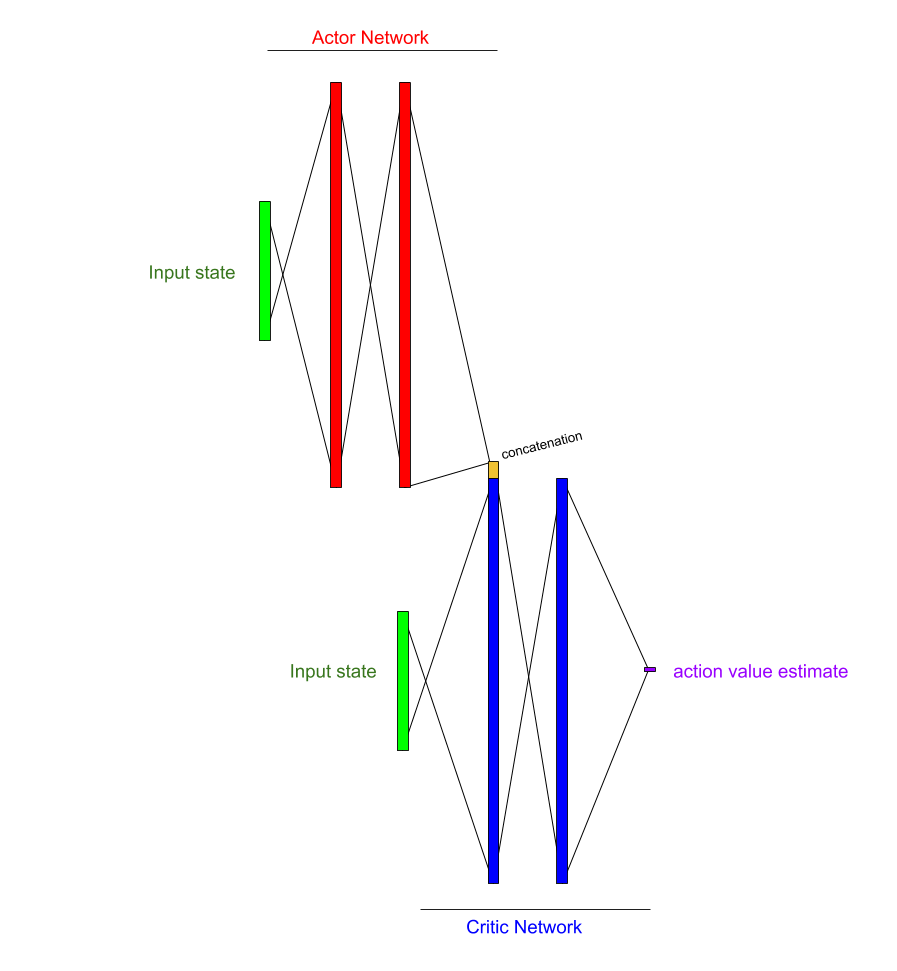
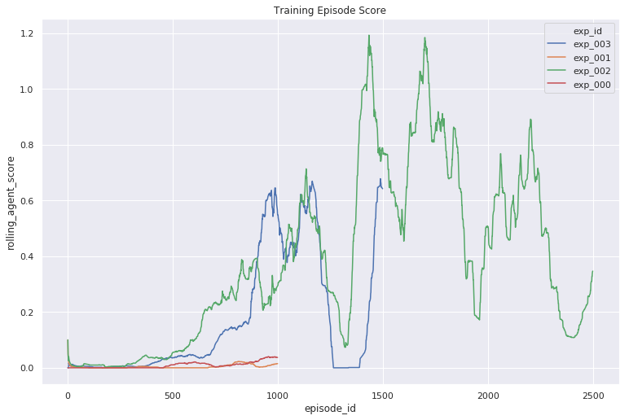

## Deep RL Nanodegree Project: Tennis

## Introduction

The objective of this project task was to implement a deep reinforcement learning solution for the 
multi-agent Unity Engine ML-Agent Tennis environment.  This report outlines and 
describes my solution, highlighting the important regions of code, results that demonstrate 
solution of the task,  as well as future directions that could be explored to make the solution of 
this task even faster.  

## Methods and Model Description
### Repository Architecture and Development Process
This solution was coded in an agile process, by which minimum viable product models were iterated 
until a full solution was achieved.  In order to aid in this process, a client model interface was 
generated, in which new versions of models could be loaded and run via a training script and its 
calls to a generic model API.  The process of training is observed in the file `./scripts/train.py`.

### Training Script
The training script is generic and is responsible for interacting with a Model object API to perform
 the same set of steps for all model performance comparisons.  In brief, it is responsible for 
checking the repository configs settings to load a model version into the client model, and then 
interacts with that client's API in order to train, checkpoint, record performance, etc of the 
agent over the coarse of training.  

Upon running the script a progress bar is informative of the agent's current performance, in 
addition to mean loss scores for each network (discussed in more detail below).  The scores of each 
episode for each agent are recorded, alongside the hyperparameters and configuration dictionaries 
that were used to launch the training.  Thus any training experiment can be restored or repeated 
exactly, if required.

### Evaluation Script
An evaluation script was utilized to compare the various checkpoints made during each model's 
training process, whereby network updates and random action choices are not utilised.  The result
of running the evaluation script is the recording of a large number of episode repetition scores for
each checkpoint of a model.  With this information, it is easy to compile a mean average episode 
score over the course of an agent's training.  

## Solution

### Base Network Architecture

My solution employed a multi-agent DDPG network solution (MADDPG).  A single
DDPG model was trained for each agent in the 2-agent game.  

Figure 1 - Description of the Discrete Deep Policy Gradient model architecture.  

### Training the network

A series of parameter sets were used to train the `MADDPG` model using the same training script.  
Various parameters were modified and tested over the different model versions.  

The final model solution selects actions using the actor network, with random noise added with 
propensity epsilon, which decreases over time.  Experiences are 
collected and stored  in an experience buffer, were the oldest experiences were
displaced after a certain buffer size had been reached.  Experiences from this buffer were sampled
randomly for each training step.  Each training step compared the expected Q_value for the recorded
state action pair against a target Q value composed of the actual reward recorded for the 
state-action combined with the discounted future return estimate which is generated from a "target"
copy of the "critic" network, which selects the next_actions using a target "actor" network.  The 
loss between these estimates represents error in estimation between actual episode returns and 
expected episode returns for a given state action.  

This loss is backpropagated across the actual critic network, which is in turn used to generate 
future Q-estimates for a state-action pair.  A soft-update that transfers weights from the actual critic
network to the target network is then performed.  

In order to actually choose actions given a state, the algorithm employs an actor network.  The 
actor network is responsible for outputing actions in a continuous space given encountered states.  
The actor network is trained as follows.  On-policy actions are generated given the encountered 
states.  These on-policy actions are then fed to the live critic network, which concatenates 
the on-policy actions as part of the network.  The forward propigation of this network provides a 
value representing the expected return for the on-policy actions given input states.  We train the 
actor network to output actions that generate the highest reward value by using the critic's 
Q-estimate as a reward function for gradient ascent.  Finally, a soft-update transfers 
some weights from the actual actor network to the target actor network.   

The code for this training can be found in the `execute_training_step` method of 
`model/MADDPG/model.Model` object.

Parameters and hyperparameters were adjusted for each experiment, and can be observed by examining
each experiments `hyperparams.json` and `params.json` file.  Run time parameters are also stored
alongside the training results in the data directory for posterity.  

## Results  

The episode scores for each agent was recorded after every training episode.  The maximum score for
either agent for a given episode is used to determine whether the task has been solved.  Although
the training script employs the addition of random noise to each set of DDPG network predicted 
actions the task was solved for experiments 002 and 003 after approximately 1000 episodes.  Scores
during training appeared to be unstable and constantly dropped off.

The networks for these models were checkpointed and standard intervals, and these checkpoints were 
used for evaluation of the agent's ability in the task environment.  

### Evaluation performance

Figure 2 - Evaluation of the model checkpoints made during training of both experiments that 
appeared to solve the task. 

Model checkpoints were evaluated using a script in which no noise was added to actions selected
by the agents' DDPG actor network.  Over the course of 100 episodes, a reliable estimate of 
the agent's combined performance can be observed.  The maximum score of an agent given the worst
performance of its partner, is 0.1 (one successful return).  Therefor to solve the task, both agents
must return the tennis ball several times on average.  The first checkpoint to solve the task was 
`exp_002 checkpoint 640`.  The highest performing checkpoint was `exp_002: ckpt 1620`.  

### Loading the product model
The highest performing model weights can be restored and evaluated by running `make mount-prodmod` 
from inside a docker container, and then `python3 ./scripts/evaluate.py`.  The make command mounts 
pretrained checkpoint weights from a mounted directory in the base docker image.  
The docker image is freely available at `ccthompson/drlnd:0.0.7` and will be pulled automatically
via the installation instructions in the README.

## Conclusion
In conclusion, a basic implementation of the Multi-Agent Deterministic Discrete Policy Gradient 
algorithm, utilising small two-layer networks for actor and critic models for each agent in a 2 
agent game was capable of 
efficiently solving the `UnityEngine Tennis` task. 

## Discussion

It is unlikely that the optimal solution has been trained here, as a grid search over the set of 
parameter and hyperparameters would likely yield a solution that trains more efficiently and 
provides a more stable score over time.  It is unclear to me why scores during training of the 
agents was so unstable, yet continued to bounce back rapidly over time.  Would more training steps
result in a stable training curve?  Or would the continuous stochastic rise and fall of training 
scores continue in perpetuity?  

One hypothesis I'd like to test is the size of the experience buffer on training stability.  
Generally, larger buffers provide a more stable learning experience, due to the inability of the 
network to fixate on a particular state that continues to arrive due to an overfit action sequence.
However, this did not appear to be the case during early experiments for this project.  

